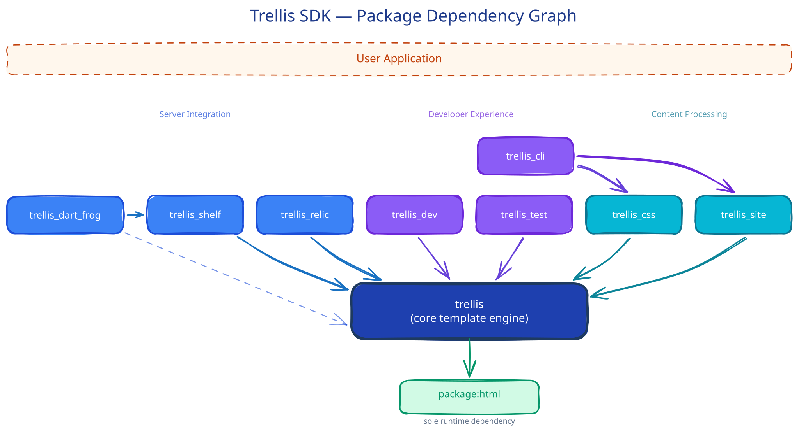

# Trellis SDK — System Architecture

Canonical reference for understanding the Trellis SDK architecture: how the packages compose, what each package is responsible for, the dependency graph, and how a request flows through the system.

**Current through**: v0.7 (engine) / SDK Phase 3 (post `trellis_test` merge) + docs-site S01 (`trellis_site` weighted ordering + nested-section lineage) + docs-site S02 (`trellis_site` hierarchical `${site.menu}` navigation tree) + docs-site S03 (`trellis_site` URL path-prefix) + docs-site S04 (`arbor` docs theme) + docs-site S05 (top-level `site/` scaffold + marketing landing) + docs-site S06 (docs IA: getting-started + syntax reference) + docs-site S07 (GitHub Pages CI deploy + link-integrity gate) + docs-site S08 (`trellis_site` in-section `${page.prev}`/`${page.next}` neighbors) + docs-site S09 (vendored client-side search) + docs-site S10 (per-package guides + theme-authoring guide)

---

## System Overview

Trellis is a Dart toolkit for building server-rendered web applications and static sites. It consists of independently publishable packages in a monorepo, centered around a core template engine.



*Source diagram maintained in the project's internal design repository.*

---

## Package Responsibilities

### Current (v0.7 / SDK Phase 3)

| Package | Responsibility | Dependencies | Status |
|---|---|---|---|
| **`trellis`** | HTML template engine: parsing, expression evaluation (incl. utility objects), processor pipeline, fragment rendering, caching, validation, template inheritance, contextual escaping. Also includes testing utilities via `testing.dart` (test engine factory, CSS-selector matchers, snapshot golden file testing, fragment helpers). | `package:html` | v0.7.0 (unpublished) |
| **`trellis_shelf`** | Shelf middleware: engine injection, HTMX helpers, security defaults (CSRF, CSP), response builders | `trellis`, `shelf`, `crypto` | v0.1.0 (unpublished) |
| **`trellis_dart_frog`** | Dart Frog integration: `trellisProvider()` DI middleware, response helpers (`renderPage`, `renderFragment`, `renderOobFragments`), HTMX detection, CSRF/security middleware bridged from `trellis_shelf` | `trellis`, `trellis_shelf`, `dart_frog` | v0.1.0 (unpublished) |
| **`trellis_relic`** | Serverpod Relic integration: response helpers with explicit engine passing, HTMX detection, `trellisSecurityHeaders()` middleware. No CSRF (Relic form parser gap). | `trellis`, `relic` | v0.1.0 (unpublished) |
| **`trellis_dev`** | Dev tools: SSE browser hot reload, script injection middleware | `trellis`, `shelf` | v0.1.0 (unpublished) |
| **`trellis_css`** | CSS processing: Dart-native SASS/SCSS compilation via `package:sass`, `tl:scope` fragment-scoped CSS via CSS `@scope` | `trellis`, `sass`, `html` | v0.1.0 (unpublished) |
| **`trellis_site`** | Static site generation: content discovery, front matter, Markdown, taxonomies, pagination, sitemap, shortcodes, data cascade, Atom/RSS feed generation, JSON search index | `trellis`, `markdown`, `yaml` | v0.1.0 (unpublished) |
| **`trellis_cli`** | CLI tool: `trellis create` (htmx + blog + dart_frog + relic templates), `trellis build` (SSG pipeline + SASS), `trellis serve` (local preview server) | `args`, `shelf`, `shelf_static`, `trellis_css`, `trellis_site` | v0.2.0 (unpublished) |
| ~~`trellis_test`~~ | *Merged into `trellis` core as `testing.dart` entry point (2026-03-18)* | — | — |

---

## Dependency Rules

From [ADR-004](../adrs/ADR-004-sdk-package-architecture.md):

1. **`trellis` (core) depends on no SDK package** — only `package:html`
2. **Integration packages** (`trellis_shelf`, `trellis_dev`) may depend on `trellis`, never the reverse
3. **Tooling packages** (`trellis_css`, `trellis_cli`) may depend on runtime packages only for orchestration
4. **No cyclic package dependencies** — the dependency graph is a DAG
5. **Optional features stay optional** — CSS, SSG, and dev tools never become transitive deps of core

```bash
trellis_cli ──► trellis_site ──► trellis ──► package:html
     │               │
     │               ├──► markdown
     │               └──► yaml
     ├──► trellis_css ──► trellis
     │         │
     │         ├──► sass
     │         └──► html
     ├──► shelf
     └──► shelf_static
trellis_shelf ──► trellis ──► package:html
     │
     └──► shelf
trellis_dart_frog ──► trellis_shelf ──► trellis
     │
     └──► dart_frog
trellis_relic ──► trellis ──► package:html
     │
     └──► relic
trellis_dev ──► trellis
     │
     └──► shelf
```

---

## Request Flow: Shelf + Trellis + HTMX

A typical request through a Trellis SDK application:

```
 Browser request
        │
        ▼
┌───────────────────────────────────────────────────┐
│                  Shelf Pipeline                   │
│                                                   │
│  logRequests()                                    │
│       │                                           │
│       ▼                                           │
│  trellisSecurityHeaders()  ← X-Frame, CSP, etc.   │
│       │                                           │
│       ▼                                           │
│  trellisEngine(engine)     ← inject into context  │
│       │                                           │
│       ▼                                           │
│  trellisCsrf(secret: ...)  ← token gen/validate   │
│       │                                           │
│       ▼                                           │
│  Router                                           │
│   ├─ GET /           → homeHandler                │
│   ├─ POST /todos     → createTodoHandler          │
│   └─ static files    → shelf_static               │
└───────────────────────────────────────────────────┘
        │
        ▼
┌───────────────────────────────────────────────────┐
│                  Route Handler                    │
│                                                   │
│  1. Get engine from request context               │
│  2. Check: isHtmxRequest(request)?                │
│     ├─ Yes → renderFragment(source, fragment, ctx)│
│     └─ No  → render(source, ctx)                  │
│  3. Return htmlResponse(html)                     │
└───────────────────────────────────────────────────┘
        │
        ▼
┌───────────────────────────────────────────────────┐
│               Trellis Engine                      │
│                                                   │
│  1. Parse HTML (or LRU cache hit)                 │
│  2. Clone DOM                                     │
│  3. Collect fragments                             │
│  4. Process DOM (priority-sorted processors)      │
│  5. Serialize to HTML string                      │
└───────────────────────────────────────────────────┘
        │
        ▼
  HTML response → Browser
  (full page or HTMX fragment)
```

### HTMX Fragment Pattern

When the browser makes an HTMX request (`HX-Request: true`), the handler returns only the targeted fragment instead of the full page. `renderFragment()` extracts and processes a single `tl:fragment` from the template. `renderFragments()` returns multiple fragments for OOB (out-of-band) swaps.

### Dev-Mode Hot Reload (trellis_dev)

In development, a parallel SSE connection keeps the browser updated:

```
Browser                          Server
   │                                │
   ├── EventSource(/_dev/reload) ──►│  SSE connection
   │                                │
   │   [developer edits template]   │
   │                                ├── FileSystemLoader.changes fires
   │                                ├── Engine cache cleared
   │◄── SSE: event: reload ─────────│  Broadcast to all clients
   │                                │
   ├── location.reload() ──────────►│  Browser refreshes
   │                                │
```

---

## Template Inheritance (SDK Phase 1)

Template inheritance adds a **pre-pass** before the normal render pipeline:

```
Source HTML string
       │
       ▼
┌──────────────────┐
│ 1. Normalize     │
└──────────────────┘
       │
       ▼
┌──────────────────┐
│ 2. Parse + Cache │
└──────────────────┘
       │
       ▼
┌──────────────────┐
│ 3. Clone DOM     │
└──────────────────┘
       │
       ▼
┌──────────────────────────────────────┐
│ NEW: Inheritance Resolution Pre-Pass │
│                                      │
│  Detect tl:extends on root element   │
│  ├─ Load parent layout               │
│  ├─ Resolve recursively (if parent   │
│  │   also extends)                   │
│  ├─ Merge: replace tl:define blocks  │
│  │   in parent with child overrides  │
│  └─ Remove tl:extends/tl:define attrs│
└──────────────────────────────────────┘
       │
       ▼
┌──────────────────┐
│ 4. Collect       │  ← runs on MERGED DOM
│    Fragments     │     (parent fragments visible)
└──────────────────┘
       │
       ▼
┌──────────────────┐
│ 5. Process DOM   │
└──────────────────┘
       │
       ▼
┌──────────────────┐
│ 6. Serialize     │
└──────────────────┘
```

See [Template Engine Architecture](template-engine.md) for render pipeline details.
Template inheritance (`tl:extends`/`tl:define`) is part of the SDK Phase 1 feature set.

---

## CSS Processing (SDK Phase 2)

`trellis_css` provides two capabilities:

### SASS/SCSS Compilation

Dart-native SASS compilation via `package:sass` (the canonical Dart SASS implementation). No Node.js or npm required.

```bash
Source (.scss/.sass)  ──►  TrellisCss.compileSass()  ──►  CSS output
                           TrellisCss.compileSassString()
                           - OutputStyle: expanded / compressed
                           - Syntax: scss / sass (indented)
                           - Load paths for @use/@import
```

The `trellis build` CLI command automatically compiles `.scss`/`.sass` files in the static directory (skipping `_` partials) and writes `.css` files to the output directory.

### Fragment-Scoped CSS (`tl:scope`)

The `CssDialect` registers a `ScopeProcessor` that wraps fragment `<style>` content in CSS `@scope`:

```html
<div tl:fragment="card">              <div class="tl-scope-card">
  <style tl:scope>                      <style>
    h2 { color: navy; }      ──►         @scope (.tl-scope-card) {
  </style>                                  h2 { color: navy; }
  <h2>Title</h2>                          }
</div>                                  </style>
                                        <h2>Title</h2>
                                      </div>
```

- Scope class added to fragment root element
- Per-fragment CSS travels with HTMX partial responses
- Requires CSS `@scope` browser support (Baseline Dec 2025)

---

## Static Site Generation (SDK Phase 2)

`trellis_site` provides a full SSG pipeline orchestrated by `TrellisSite.build()`:

```
content/**/*.md   ──►  ContentDiscovery    (recursive .md scanning, URL derivation)
                       FrontMatterParser   (YAML extraction, draft detection)
                       ShortcodeProcessor  (pre-Markdown: {})
data/**/*.yaml    ──►  MarkdownRenderer    (GitHub-flavored MD → HTML, TOC, summary)
                       ShortcodeProcessor  (post-Markdown: <!-- tl:name -->)
layouts/**/*.html ──►  TaxonomyCollector   (term collection, virtual pages)
static/**         ──►  PageGenerator       (layout resolution, data cascade, Trellis render)
                       SitemapGenerator    (sitemap.xml with lastmod)
                       FeedGenerator       (Atom + RSS feeds — opt-in)
                       SearchIndexGenerator (JSON search index — opt-in)
                       Static asset copy   (+ bundle asset copy)
                            │
                            ▼
                      output/ directory
```

### Pipeline Stages

1. **Clean** output directory
2. **Discover** pages — recursive `.md` scan, Hugo-style URL derivation (with optional `pathPrefix` applied at the single `deriveUrl` seam), page bundle detection
3. **Parse** front matter — YAML extraction, draft flagging
4. **Shortcodes (pre-MD)** — `{}` and `{} content {}` processed before Markdown
5. **Render** Markdown — GitHub-flavored via `package:markdown`, summary + TOC extraction
6. **Shortcodes (post-MD)** — `<!-- tl:name -->` processed after Markdown
7. **Taxonomies** — collect terms from front matter, generate virtual listing and term pages
8. **Generate** HTML — priority-ordered layout resolution, 5-level data cascade, Trellis `renderFile()`
9. **Static assets** — copy (skip `.scss`/`.sass`), copy bundle assets
10. **Sitemap** — `sitemap.xml` with `<lastmod>` from date or mtime
11. **Feeds** — Atom `feed.xml` (+ optional `rss.xml`) when `feeds:` config present; per-section feeds supported
12. **Search index** — JSON array at configured path when `search.enabled: true`

### Layout Resolution Order

1. Front matter `layout` field
2. Type-specific: `{type}/{single|list}.html`
3. Section-specific: `{section}/{single|list}.html`
4. Default: `_default/{single|list}.html`
5. Home pages: `home.html` > `index.html` > `_default/list.html`

### Data Cascade (lowest to highest priority)

1. Site params (`${site.*}`)
2. Global data files (`${data.*}` from `data/*.yaml`)
3. Section front matter (from `_index.md`)
4. Page front matter

### Pagination

List pages (section, home, taxonomy term) are automatically paginated when `paginate` is set in config. Templates access `${pagination.page}`, `${pagination.totalPages}`, `${pagination.hasNext}`, `${pagination.prevUrl}`, `${pagination.nextUrl}`.

Hybrid static/dynamic: Same Trellis templates can serve both SSG-generated pages and HTMX-enabled dynamic fragments at runtime.

### Content Ordering & Nested Sections

A single canonical comparator defines page order everywhere. Within a section, integer-`weight` pages sort first (ascending by `weight`); ties and all unweighted pages fall through to the existing date-descending-then-URL order, so sections with no `weight` are byte-for-byte unchanged. A malformed `weight` is warned about (naming the page) and treated as unweighted; the build never aborts.

The content model is additive-nested: `Page.section` stays the top-level folder, while the new immutable `Page.sectionPath` field carries the full lineage (e.g. `docs/guides`), surfaced to templates as `${page.sectionPath}` and `${page.ancestors}` (a plain list of cumulative section paths). A separate, additive `${page.breadcrumbs}` field carries the same trail as structured `{url, title}` nodes — each ancestor section's prefixed URL (or `''` for a synthesized `_index.md`-less folder) plus a menu-consistent 3-tier-fallback title — for themes that render a breadcrumb bar without re-deriving titles. A nested `_index.md` lists exactly its own level's pages (excluding sibling sub-sections).

`orderedSectionPages(sectionPath, allPages)` is the single reusable ordered-section seam (own-level lineage filter + canonical comparator). `PageGenerator`'s `${pages}` listing and pagination route through it, and it is the contract downstream navigation (menu tree) and prev/next resolution consume verbatim — one ordering source, no divergent second sort.

### Navigation Menu Tree

`NavigationBuilder` produces one nested `${site.menu}` tree of `{title, url, children}` map nodes, mirroring the content section hierarchy. It is built once from the discovered pages and injected into the shared `siteParams` (`site.menu`) at both assembly sites (with and without taxonomy), so it rides the existing every-page context to **every** render — single, section, home, and taxonomy virtual pages — satisfying FR3's every-page requirement with a single injection point (list-page-only assembly would omit it from single/home renders). Own-level page order comes from `orderedSectionPages` (the builder holds no comparator or lineage filter of its own); sections nest by `Page.sectionPath` lineage. Because the tree is shared across renders it carries **no** per-page active flag: a theme resolves the active page and its ancestor trail by comparing each `node.url` against `${page.url}` at render time. Title precedence is `menu_title` → `title` → humanized URL slug. Drafts and `menu_exclude: true` pages are filtered (mirroring `!isDraft`); an opted-out section drops its own node but hoists surviving children to its parent, while a folder with no `_index.md` still yields a synthesized node. Empty content yields `[]`, and sites not referencing `${site.menu}` stay byte-for-byte unchanged. Taxonomy virtual pages are injected after the tree is built, so they receive the menu but never appear as menu nodes.

### In-Section Prev/Next

`PageGenerator._resolvePrevNext(page, allPages)` supplies each **single doc page** with `${page.prev}`/`${page.next}` neighbor references (`{url, title}` maps). It holds **no** comparator or lineage filter of its own: it calls `orderedSectionPages(page.sectionPath, allPages)` — the same single ordering seam the `${pages}` listing and the `NavigationBuilder` menu tree consume — finds the page's index in that own-level sequence, and returns the flanking pages. Prev/next order therefore matches sidebar and list order by construction; a second sort here would be the only way they could diverge. Boundaries are handled by absence (no `prev` at index 0, no `next` at the last index, neither for a single-element section), and the keys attach **additively** onto the existing `pageToMap` output in `_buildContext` — each only when present. Attachment is gated to the non-list single-doc render branch (`PageKind.single` and not a list page), so section, home, and taxonomy pages (including single-kind taxonomy *term* pages, which are list pages via `termName`) receive neither key and keep their `paginator.dart` sequencing. The `arbor` theme's `_default/single.html` renders a `tl:if`-guarded region reading these values, so only the links that exist appear. Because attachment only adds keys (never mutates existing ones), a site whose templates do not reference `${page.prev}`/`${page.next}` is byte-for-byte unchanged.

### URL Path-Prefix

`pathPrefix` (config) serves a site under a sub-path (e.g. GitHub project pages at `/my-site/`). It is applied at the **single `deriveUrl` seam** during discovery, so `page.url` itself carries the prefix and every downstream consumer inherits it with no per-consumer change: `${page.url}` links, the section/menu tree, prev/next, and the search-index `url` fields. Sitemap/feed generators compose `baseUrl` + the (now-prefixed) `page.url`, so the prefix appears exactly once (`baseUrl` — the canonical origin — and `pathPrefix` — the sub-path — are orthogonal and compose). Only internal root-absolute paths (leading `/`, not `//` protocol-relative, not scheme-bearing) are rewritten; absolute/external URLs pass through verbatim. `SiteConfig` normalizes the value (`x`, `/x`, `x/`, `/x/` → `/x/`; `''` and `/` → no prefix) and rejects an un-normalizable value (scheme-bearing/protocol-relative or non-string) with a `SiteConfigException` before any output is written. The empty (default) prefix is a literal no-op — output is byte-for-byte unchanged. Hand-written literal asset references the engine cannot see are opted in by theme authors via `${site.pathPrefix}` (e.g. `tl:href="${site.pathPrefix} + 'css/main.css'"`). The prefix lives in emitted URLs only, **not** in the on-disk output layout: page files are written at their *unprefixed* paths (via `stripPathPrefix` in the output-write + bundle-asset steps), so the whole `output/` tree is published as the site root and the host mounts it under the prefix (GitHub Project Pages serves the artifact root at `/<repo>/`). Nesting output under the prefix would double-apply it. **Hand-written links get the prefix too:** a final `applyPathPrefixToLinks` pass over each emitted page rewrites root-absolute internal `href`/`src` (Markdown content links, theme literals, vendored-asset refs) that are not already prefixed — expected SSG behavior — while relative links, anchors, external URLs, and escaped code examples are left untouched. Theme resolution (`themeDir`) is `p.normalize`d at all three computation sites (engine manifest/loader + CLI SASS compile) so a relative `theme:` value that escapes the site dir resolves; the CLI's `build` also carries `pathPrefix` through and accepts a `--path-prefix` override.

---

## Expression Utility Objects (SDK Phase 3)

`trellis` core gains a `${#name.method(args)}` utility object syntax, resolved at the evaluator level — not injected into the user context map.

```
${#strings.capitalize(name)}     →  "Hello"
${#lists.where(items, 'active')} →  filtered list
${#dates.format(date, 'yyyy-MM-dd')} →  "2026-03-17"
```

### Built-in Utility Objects

| Object | Methods | Notes |
|---|---|---|
| `#strings` | `capitalize`, `upperCase`, `lowerCase`, `trim`, `isEmpty`, `isNotEmpty`, `length`, `contains`, `startsWith`, `endsWith`, `replace`, `substring`, `indexOf`, `split`, `join`, `repeat` | 16 methods |
| `#numbers` | `abs`, `min`, `max`, `round`, `floor`, `ceil`, `isOdd`, `isEven`, `formatDecimal`, `formatCurrency`, `formatPercent` | 10 methods |
| `#dates` | `format`, `formatDate`, `formatTime`, `now`, `year`, `month`, `day`, `hour`, `minute`, `second`, `isBefore`, `isAfter` | 12 methods |
| `#lists` | `size`, `isEmpty`, `isNotEmpty`, `first`, `last`, `contains`, `sort`, `sortBy`, `reverse`, `take`, `skip`, `where`, `map`, `join`, `flatten` | 15 methods |

`#dates.format` and `#numbers.format` detect `package:intl` at runtime — use locale-aware formatting if available, fall back to English-only built-in implementation. No new dependencies added to core `trellis`.

Parser: `${#ident.method(args)}` is parsed inside `_parseDollarExpr()` → `UtilityCallExpr` AST node. `#{key}` message expressions are parsed in `_parseMessageExpr()` — no collision.

---

## Framework Integrations (SDK Phase 3)

### Dart Frog (`trellis_dart_frog`)

Wraps `trellis_shelf` for use in Dart Frog's `RequestContext`-based DI system:

```
routes/_middleware.dart
  trellisProvider(engine)      ← engine → RequestContext
  trellisSecurityHeaders()     ← bridged from trellis_shelf via fromShelfMiddleware
  trellisCsrf(secret: ...)     ← bridged from trellis_shelf via fromShelfMiddleware

route handler
  renderPage(context, 'template', ctx)         ← full page
  renderFragment(context, 'template', 'frag', ctx)  ← named fragment
  renderOobFragments(context, 'template', [...], ctx) ← HTMX OOB
  isHtmxRequest(context)  htmxTarget(context)  ← HTMX detection
```

The CSRF bridge reads the Dart Frog request body via `request.bytes()` then creates a `shelf.Request` to hand off to `trellis_shelf.trellisCsrf`. Dart Frog test files use `concurrency: 1` (`dart_test.yaml`) because `serve()` starts real HTTP servers that cannot run in parallel within a single Dart isolate.

### Relic (`trellis_relic`)

Thin adapter for Serverpod Relic — no DI framework, engine passed explicitly:

```
RelicApp(hostname, port)
  .use(trellisSecurityHeaders())    ← Relic middleware chain

handler(Request request) async {
  return renderPage(request, engine, 'template', ctx);
    ← returns Relic Response with Body.fromString(html, mimeType: MimeType.html)
}
```

No CSRF support (Relic lacks a form body parser). Middleware only fires for matched routes (Relic behavioral difference vs Shelf). Does NOT depend on `trellis_shelf` or `shelf`.

---

## SSG Feed & Search Index (SDK Phase 3)

`trellis_site` pipeline gains two optional post-generation steps:

```
... (steps 1-9 as before) ...
10. Feed generation   ← opt-in via feeds: config; Atom (RFC 4287) + optional RSS 2.0
11. Search index      ← opt-in via search: config; JSON array (Lunr.js / Fuse.js / Pagefind)
```

### Feed Generation (`FeedGenerator`)

- Activated by `feeds:` section in `trellis_site.yaml`
- Outputs `output/feed.xml` (Atom) and optionally `output/rss.xml` (RSS 2.0)
- Per-section feeds at `output/{section}/feed.xml`
- Items sorted newest-first, limited by `feeds.limit`; draft pages and `feed: false` front matter excluded
- `${site.feeds.atom}` injected into template context for `<link rel="alternate">` tags
- XML built via string construction — no new dependencies

### Search Index (`SearchIndexGenerator`)

- Activated by `search: enabled: true` in `trellis_site.yaml`
- Outputs a JSON array at configured path (default: `output/search-index.json`)
- Configurable fields: `title`, `summary`, `content`, `tags`, `date`, `section`, `url`
- HTML stripping (`search.stripHtml: true`) and content truncation (`search.maxContentLength`)
- Only `PageKind.single` content pages indexed; draft pages, excluded sections, and `search: false` front matter omitted

---

## Docs Theme & Site (docs-site S04–S10)

Two deliverables ship in the repo root alongside the packages: the **`arbor`** documentation theme (`themes/arbor/`) and the **Trellis docs site** (`site/`). Neither is a publishable package — `arbor` is an installable theme consumed via a `theme:` reference, and `site/` is content built by `trellis_cli`.

### Arbor Docs Theme (`themes/arbor/`)

A documentation-oriented theme sitting beside the `verdant` blog theme (both are standard-params-contract themes). It consumes the SSG's navigation surfaces directly: a hierarchical sidebar from `${site.menu}` (active/active-trail highlighting resolved at render time), an in-page TOC from `${page.toc}`, a breadcrumb bar from `${page.breadcrumbs}`, and prev/next links from `${page.prev}`/`${page.next}`. A CLI-generated SASS **bridge wrapper** (`site/.trellis/build/bridge_main.scss`) `@import`s the theme's params + `sass/main.scss` so `trellis build` compiles the theme's stylesheet with the site's `theme_params` bound.

**Vendored-JS discipline** — all client-side JS is vendored (committed), served same-origin, and pinned with a per-file Subresource Integrity `sha384-…` hash plus `crossorigin="anonymous" defer`. **No CDN, no `npm`/Node, no runtime fetch from an external host.** Two assets:

- **Prism 1.29.0** syntax highlighter — core + explicit per-language grammar components (the remote-fetching autoloader is deliberately *not* used); language coverage `dart`/`html`/`css`/`yaml`/`bash`/`scss`/`markdown` over the `language-*` classes `trellis_site` already emits. Provenance and the 9 SRI hashes are recorded in `themes/arbor/VENDORED.md`.
- **`search.js`** — a hand-authored, dependency-free vanilla-JS search client (no Lunr/Fuse/MiniSearch vendored library), chosen to keep the asset small and fully auditable while still satisfying the vendored + pinned + SRI discipline.

Both syntax highlighting and search are **progressive enhancements**: the docs are fully readable and navigable with JavaScript disabled.

### Client-Side Search Flow (S09)

The engine and the theme meet at one artifact — `search-index.json`:

```
trellis_site build                         arbor theme (browser)
  SearchIndexGenerator                       search.js (vendored, SRI-pinned)
  (search.enabled: true)                       │
        │  emits                                │  reads index URL from the shell's
        ▼                                       │  data-search-index attribute
  output/search-index.json  ──────────────────►│  (computed with ${site.pathPrefix},
        (url fields already                     │   so the fetch resolves under any
         pathPrefix-prefixed)                    │   deploy sub-path)
                                                 ▼
                                          same-origin fetch → in-memory filter →
                                          result list (title + snippet, entry.url used verbatim)
```

The `<input>` ships `disabled` in the static HTML and is enabled only after the index loads; any index-fetch failure (missing file, non-OK response, malformed payload) hides the control so the page stays usable. Result links use each entry's already-prefixed `url` verbatim — never re-prefixed client-side.

### Docs Site (`site/`)

The `site/` tree is the Trellis marketing landing + documentation IA (getting-started, the full `tl:*` syntax reference, and a per-package guide for each SDK package plus theme authoring). It carries no `pubspec` of its own; `trellis build` reads `site/trellis_site.yaml` from the working directory, which wires `theme: ../../themes/arbor` (a relative escape resolving to `<repo>/themes/arbor`), `search.enabled: true`, and the deploy target. It is published to GitHub Pages by the workflow described under [Deployment Model](#docs-site-static-github-pages) — built under `pathPrefix: /trellis/`, gated on the link-integrity check.

---

## Monorepo Structure

From [ADR-004](../adrs/ADR-004-sdk-package-architecture.md) and [ADR-007](../adrs/ADR-007-monorepo-tooling.md):

```
trellis/                          # monorepo root
├── pubspec.yaml                  # Dart workspace + Melos config
├── packages/
│   ├── trellis/                  # core template engine
│   ├── trellis_shelf/            # Shelf integration
│   ├── trellis_dart_frog/        # Dart Frog integration
│   ├── trellis_relic/            # Serverpod Relic integration
│   ├── trellis_dev/              # dev tools (hot reload)
│   ├── trellis_css/              # CSS processing (SASS + tl:scope)
│   ├── trellis_site/             # static site generation
│   └── trellis_cli/              # CLI (create, build, serve)
├── starters/                     # project templates
├── themes/
│   ├── verdant/                  # blog theme (default)
│   └── arbor/                    # documentation theme (vendored Prism + search)
├── site/                         # the Trellis docs/marketing site (built by trellis_cli)
├── examples/
│   └── relic_app/                # Relic + Trellis + HTMX example
└── docs/                         # guides, API docs
```

Tooling: Dart native workspaces (shared `pubspec.lock`, local linking) + Melos v7 (versioning, changelogs, publishing, CI scripts).

---

## Deployment Model

```
Development                    Production

dart run bin/server.dart       dart compile exe bin/server.dart
      │                              │
      ▼                              ▼
  JIT execution                 Native binary (~10-20MB)
  + devMode: true               + devMode: false
  + file watching               + no watchers
  + SSE hot reload              + LRU cache (warm-up on start)
  + shelf_hotreload             + static file serving
                                + security headers
                                      │
                                      ▼
                               Docker / Cloud Run / Fly.io
                               Single binary + templates/ + static/
```

### Docs site (static, GitHub Pages)

The documentation site (`site/`) is a separate static-deploy path from the app/server
model above. `.github/workflows/deploy-docs-site.yml` builds `site/` with `trellis
build` on every push to `main` (pure Dart, no npm/Node), gates the deploy on a
pure-Dart link-integrity check (`tool/link_check.dart`), and publishes `site/output`
to GitHub Pages. The deploy target is **config-driven** via `baseUrl` + `pathPrefix`
in `site/trellis_site.yaml` (currently the Project Pages sub-path `/trellis/`); the
workflow hardcodes no domain, so a later custom-domain move is a config edit. The
integrity check is the real gate: a wrong-base-path link produces valid HTML and a
green build but a dead link in production, so it runs (with `--base-path` matching
`pathPrefix`) between build and publish and blocks the deploy on any broken internal
ref. A second, non-live root-served variant is built and checked with no base-path as
an FR10 portability regression guard.

### CLI distribution channels

The `trellis` CLI ships through three channels, all keyed off the lockstep
`vX.Y.Z` release tag (ADR-009). `.github/workflows/release-binaries.yml` compiles
per-platform AOT binaries (macOS arm64/x64, Linux x64/arm64, Windows x64) and
attaches them to the GitHub Release, then updates the Homebrew tap
`tolo/homebrew-trellis` so `brew install tolo/trellis/trellis` resolves. The same
tag drives `publish.yml`, which publishes the packages to pub.dev independently.
The linux-arm64 binary is cross-compiled on an x64 runner (`--target-os/--target-arch`).

---

## Cross-References

### Architecture Documents
- [Template Engine Architecture](template-engine.md) — Engine internals, processor pipeline, expression evaluator, caching

### ADRs
- [ADR-001: Expression Evaluator Strategy](../adrs/ADR-001-expression-evaluator-strategy.md)
- [ADR-002: Browser Hot Reload Strategy](../adrs/ADR-002-browser-hot-reload-strategy.md)
- [ADR-003: Pre-compiled Template Strategy](../adrs/ADR-003-precompiled-template-strategy.md) — deferred
- [ADR-004: SDK Package Architecture](../adrs/ADR-004-sdk-package-architecture.md)
- [ADR-005: Server Integration Strategy](../adrs/ADR-005-server-integration-strategy.md)
- [ADR-006: CSS Strategy](../adrs/ADR-006-css-strategy.md)
- [ADR-007: Monorepo Tooling](../adrs/ADR-007-monorepo-tooling.md)

### Specs
- SDK Vision — product vision, competitive positioning, phased roadmap (internal)
- SDK Phase 1 — server integration, hot reload, template inheritance, CLI (internal)

### Diagrams

Architecture diagrams are maintained as Excalidraw source files in the project's internal design repository; the dependency-graph export is embedded above.
